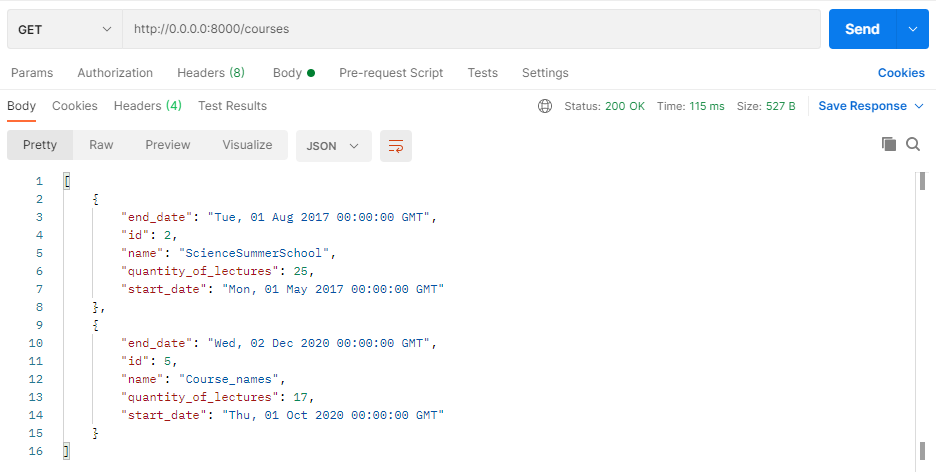
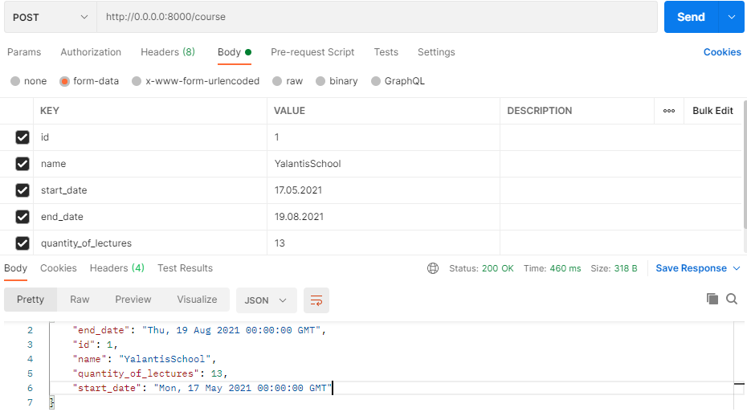
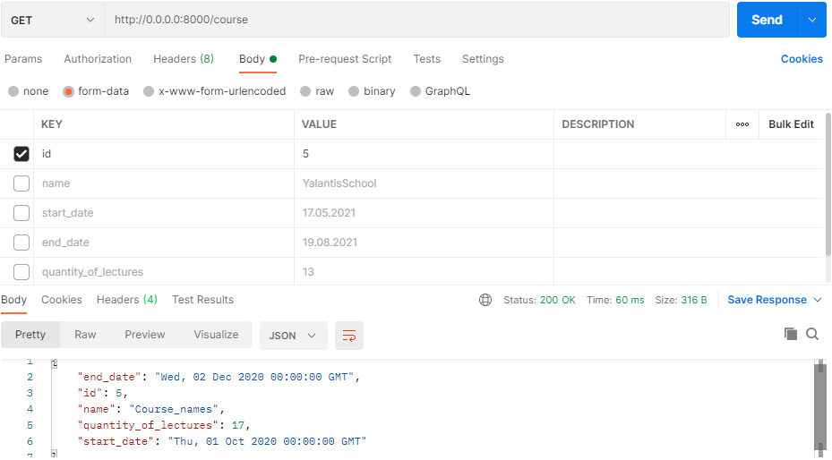
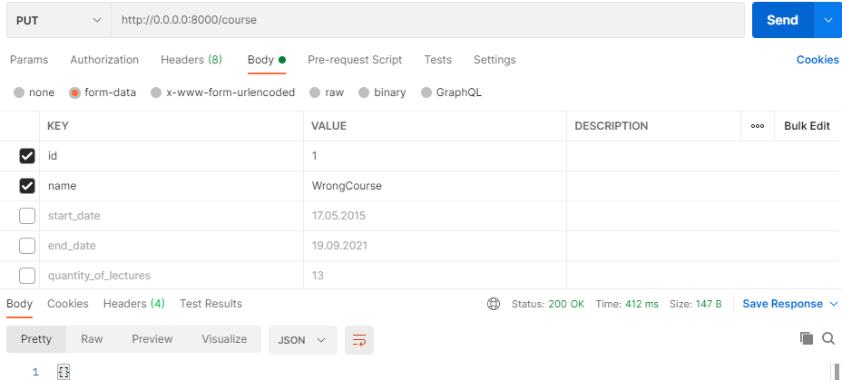
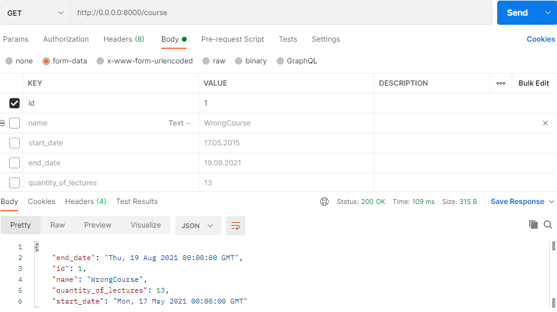

# Flask Api
## General info
There was built a CRUD courses management app based on MVC pattern.
Flask is used for creating endpoints. Project does not have a view because it is not necessary.  
App has the following features:
* create course;
* get course by id or name and date;
* get all courses;
* delete course;
* update course;
## Technologies
* python 3.7
* Flask-SQLAlchemy 2.4.4
* SQLAlchemy 1.3.13
* SqLite3
## Run project
`python run.py`   
I used postman for sending requests.
## Tests
Get all courses

Add course 

Erorr when added wrong course

Get course by id

Get course by name and date

Error with wrong name

Update operation

After update 

Deleting 

